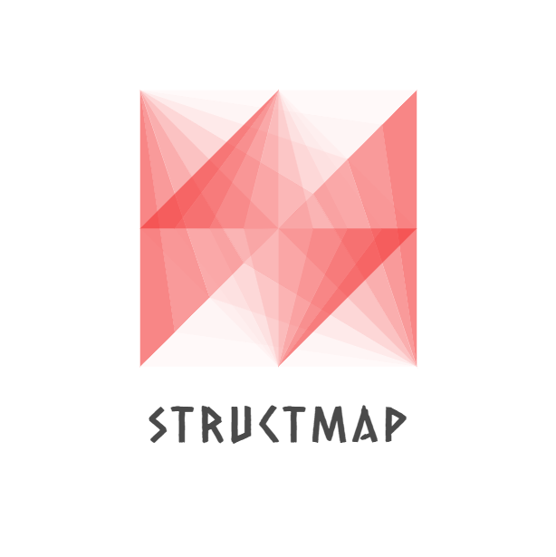

<!-- PROJECT LOGO -->
<br />
<p align="center">
  <a href="https://github.com/amulets/structmap">
    
  </a>

<!-- PROJECT SHIELDS -->
  <p align="center">
    <a href="https://github.com/amulets/structmap/graphs/contributors">
        
    </a>
    <a href="https://github.com/amulets/structmap/issues">
        
    </a>
    <a href="https://github.com/amulets/structmap/blob/master/LICENSE">
        
    </a>
    <a href="https://pkg.go.dev/github.com/amulets/structmap?tab=doc"></a>
    <a href="https://gocover.io/github.com/amulets/structmap"></a>
  </p>

  <p align="center">
    Decodifique um mapa em uma estrutura.
    <br />
    <a href="https://github.com/amulets/structmap"><strong>Explore a documentação »</strong></a>
    <br />
    <br />
    <a href="https://github.com/amulets/structmap/issues">Report Bug</a>
    ·
    <a href="https://github.com/amulets/structmap/issues">Request Feature</a> 
  </p>
</p>

<!-- TABLE OF CONTENTS -->
## Índice

- [Índice](#%c3%8dndice)
- [Sobre o Projeto](#sobre-o-projeto)
- [Começando](#come%c3%a7ando)
- [Uso](#uso)
- [1. Definindo o nome(key) do campo](#1-definindo-o-nomekey-do-campo)
  - [1.1 Tag](#11-tag)
  - [1.2 Snake case](#12-snake-case)
  - [1.3 Discovery](#13-discovery)
- [2. Definindo as flags](#2-definindo-as-flags)
  - [2.1 Required](#21-required)
  - [2.2 NoEmbedded](#22-noembedded)
- [3. Definindo as conversões](#3-definindo-as-convers%c3%b5es)
- [Licença](#licen%c3%a7a)
- [Projetos similares](#projetos-similares)

<!-- ABOUT THE PROJECT -->
## Sobre o Projeto

Structmap é uma ferramenta que te permite preencher os valores de uma estrutura `struct` tendo como base um mapa `map[string]interface{}`.

<!-- GETTING STARTED -->
## Começando

Para usar o *structmap* basta seguir os seguintes passos.

1. Instale como uma dependência:
  
    ```sh
    go get github.com/amulets/structmap
    ```

2. Crie uma instầncia do `structmap`:

    ```go
    sm := structmap.New()
    ```

3. Adicione os comportamentos desejados:

    ```go
    /**
     Única regra do structmap é que o primeiro comportamento
     precisa ser a descoberta de nome, caso não tenha,
     é preciso adicionar o name.Noop
    */
    sm.AddBehavior(name.Noop)
    ```

4. Faça o *decode* do mapa na estrutura:

    ```go
    //Sua estrutura
    type Person struct {
      Name string
      Age  int
    }
    ```

    ```go
    // Declaração da estrutura e do mapa
    person := Person{}
    data := map[string]interface{}{
      "Name":"Joselito",
      "Age": 100,
    }
    // Decode passando as informações do mapa para a estrutura
    err := sm.Decode(data,&person)
    ```
  
5. Pegue os valores pela estrutura:

    ```go
    fmt.Println(person.Name)
    //Out: Joselito
    ```

Veja o código completo [aqui][get-started]

<!-- USAGE EXAMPLES -->
## Uso

## 1. Definindo o nome(key) do campo

### 1.1 Tag

  [Código de exemplo][tag-usage]

  ```go
  type Person struct {
    Name string `structmap:"my_name"`
  }

  ...

  data := map[string]interface{}{
    "my_name": "myName",
    "name": "Joselito",
  }

  ...

  sm.AddBehavior(name.FromTag("structmap"))
  //Out: {Name:myName}
  ```

### 1.2 Snake case

  [Código de exemplo][snake-case] ou veja outros exemplo [aqui][word-case].

  ```go
  type WordCase struct {
    SnakeCase string //-> snake_case
  }

  ...

  data := map[string]interface{}{
    "snake_case": "With Snake",
    "SnakeCase": "Without snake",
  }

  ...

  sm.AddBehavior(name.FromSnake)
  //Out: {SnakeCase:With Snake}
  ```

### 1.3 Discovery

  [Código de exemplo][discovery-usage]

  ```go
  type Person struct {
    FirstName string `bson:"first_name"`
    LastName  string `json:"last_name"`
    Age       int
  }

  ...

  data := map[string]interface{}{
    "first_name": "Joselito",
    "last_name": "Otilesoj",
    "age":100,
  }

  ...

  sm.AddBehavior(name.Discovery(
    name.FromTag("bson"), //Pega o first_name
    name.FromTag("json"), //Pega o last_name
    name.FromSnake, //Pega o age
  ))
  //Out: {FirstName:Joselito LastName:Otilesoj Age:100}
  ```

## 2. Definindo as flags

### 2.1 Required

  [Código de exemplo][required-usage]

  ```go
  type Person struct {
    FirstName string `structmap:",required"`
  }

  ...

  data := map[string]interface{}{}

  ...

  sm.AddBehavior(flag.Required("structmap"))
  //Out: error -> field FirstName is required
  ```

### 2.2 NoEmbedded

  [Código de exemplo][noembedded-usage]

  ```go
  type Person struct {
    FirstName string
  }

  type Employee struct {
    Person `structmap:",noembedded"`
  }
  ...

  data := map[string]interface{}{
    "Person":map[string]interface{}{
      "FirstName":"myName",
    },
    "FirstName":"Joselito",
  }

  ...

  sm.AddBehavior(flag.NoEmbedded("structmap"))
  //Out: {Person:{FirstName:myName}}
  ```

## 3. Definindo as conversões

  [Código de exemplo][cast-usage]

  ```go
  type Person struct {
    FirstName string
    Age int
  }

  type Employee struct {
    Person
  }
  ...

  data := map[string]interface{}{
    "FirstName":"Joselito",
    "Age": "100", //A string será convertida para int
  }

  ...

  sm.AddBehavior(cast.ToType)
  //Out: {Person:{FirstName:Joselito Age:100}}
  ```

<!-- LICENSE -->
## Licença

Distribuído sob a licença MIT. Veja `LICENSE` para mais informações.

<!-- SIMILARPROJECTS -->
## Projetos similares

- [mapstructure](https://github.com/mitchellh/mapstructure)

- [structs](https://github.com/fatih/structs)
  
- [structomap](https://github.com/danhper/structomap)


<!-- MARKDOWN LINKS & IMAGES -->
<!-- https://www.markdownguide.org/basic-syntax/#reference-style-links -->
[get-started]: https://repl.it/@luclissi/GettingStarted
[snake-case]: https://repl.it/@luclissi/SnakeCase
[word-case]: https://repl.it/@luclissi/WordCase
[tag-usage]: https://repl.it/@luclissi/TagUsage
[discovery-usage]: https://repl.it/@luclissi/DiscoveryUsage
[required-usage]: https://repl.it/@luclissi/Required
[noembedded-usage]: https://repl.it/@luclissi/NoEmbedded
[cast-usage]: https://repl.it/@luclissi/CastUsage
